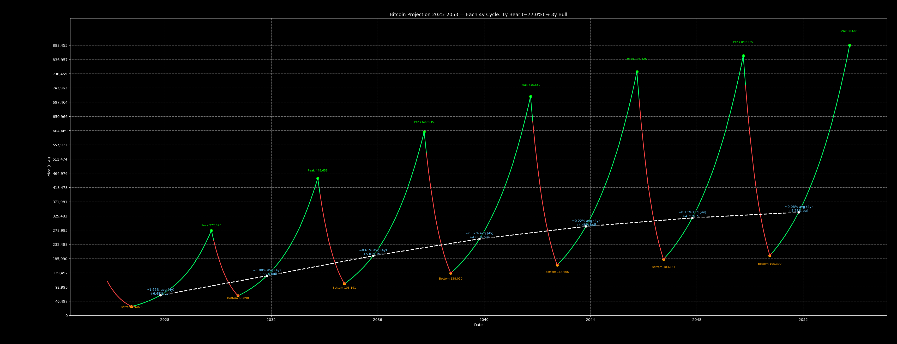
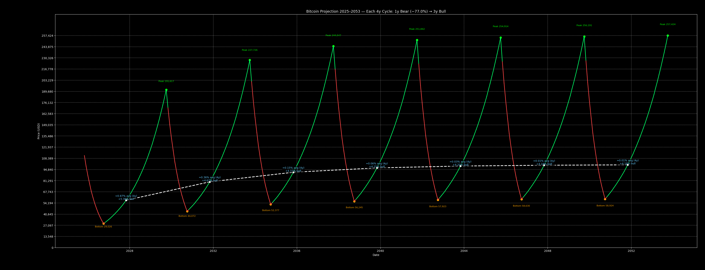
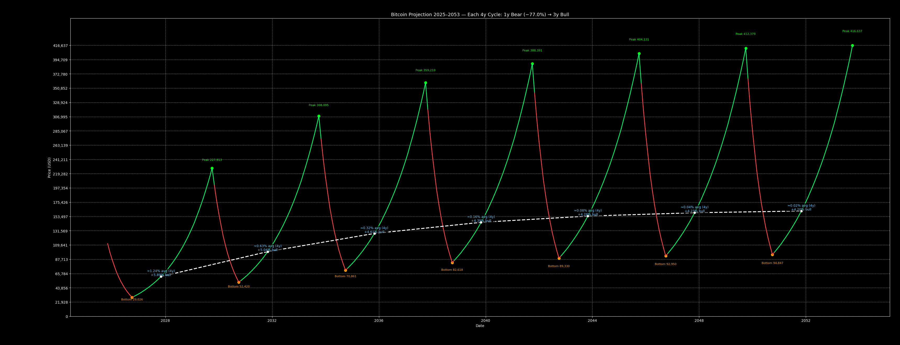

# Bitcoin Diminished Return Theory  
**A Log-Linear Model of Cycle-Based Return Decay**  
*Proposed by Răzvan Avramescu*

---

## Overview

This repository contains the research code for the *Bitcoin Diminished Return Theory* - a log-linear model describing how Bitcoin’s **average monthly returns decrease across halving cycles**.

The model does **not** attempt to predict short-term price movements.  
Instead, it provides a **macro cycle framework** for visualizing long-term diminishing growth and structural market phases.

It is based on:
- Cycle index (1, 2, 3, 4, …)
- Average monthly return across each 4-year halving cycle
- Log-linear regression applied to historical return decay
- Projection of future cycles under similar decay conditions

This model was used to forecast a **~$126,200 Bitcoin peak in 2025**, published roughly **3 years in advance**.  
After observing how tightly the model aligned with price action, the research was expanded into **three future scenarios**:

📄 Article:  
https://www.avramescu.net/bitcoins-diminishing-monthly-returns-a-decade-ahead/

---

## Method Summary

Bitcoin's historical cycle returns follow a clear **diminishing pattern**.  
The decay can be modeled with an exponential form:

```
r_cycle = A * exp(B * cycle)
```

where:
- `r_cycle` is the average monthly return of the given cycle,
- `cycle` is the halving-cycle index (1, 2, 3, 4...),
- `A` and `B` are regression parameters,
- and **B is negative**, meaning returns shrink over time.

To estimate A and B, we apply **log-linear regression**:

```
ln(r_cycle) = ln(A) + B * cycle
```

Different fitting strategies are available:

| Variant         | Description                           | Notes                                      |
|-----------------|---------------------------------------|--------------------------------------------|
| `exclude_first` | Uses cycles 2–4 only                  | Recommended (cycle 1 is a bootstrapping outlier) |
| `include_all`   | Uses cycles 1–4 equally               | Produces more conservative future returns  |
| `weighted`      | Includes cycle 1 but reduces its impact | Balanced compromise                         |

---

## Example Output

| Scenario | Image |
|---------|--------|
| Excluding cycle 1 (recommended) |  |
| Including all cycles |  |
| Weighted regression |  |

---

## Installation

```bash
pip install -r requirements.txt
```

**requirements.txt**
```
numpy>=1.20
pandas>=1.4
matplotlib>=3.4
```

---

## Usage

### Command-line
```bash
python main.py --method exclude_first
```

### In Python
```python
from model import fit_diminishing_returns, bull_rate_from_avg

cycles, r_avg_4y = fit_diminishing_returns(method="exclude_first")
```

---

## License

Released under **Creative Commons Attribution 4.0 (CC BY 4.0)**.

You are free to **use, modify, and share** this model, provided attribution is preserved:

> “Bitcoin Diminished Return Theory - Răzvan Avramescu”  
> https://www.avramescu.net/bitcoins-diminishing-monthly-returns-a-decade-ahead/

---

## Disclaimer

This model is for **research and educational purposes only**.  
It is **not financial advice**.  
Market structure can change, and past behavior does not guarantee future outcomes.

---

## Contact

If you extend or experiment with the model, I’d be happy to see your results.  
Feel free to connect or reference the article above.

